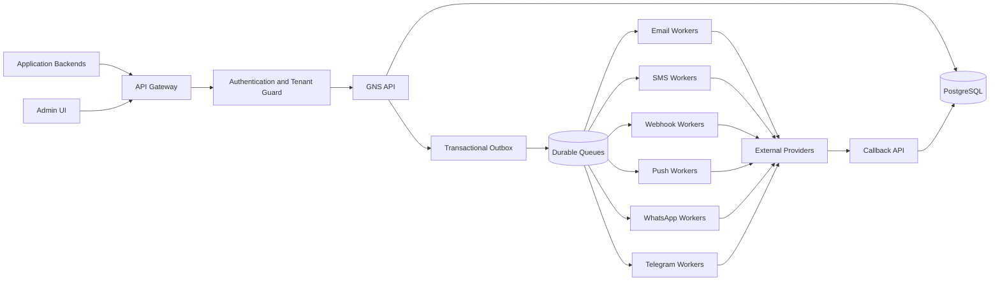

# High-Level Design

## Services

### API Gateway
TLS, WAF, request limits, rate limiting, routing.

### Management API
Apps, credentials, events, templates, providers, quotas, users.

### Runtime API
Validation, idempotency, persistence, queueing, status lookup.

### Delivery workers
Channel-specific processing and failure isolation.

### Callback processor
Verifies provider signatures and normalizes delivery events.

### Scheduler
Scheduled notifications, retries, retention, provider health checks.

## Storage

- PostgreSQL: system of record
- Secret manager: provider credentials
- Durable queue: SQS/RabbitMQ/Redis Streams
- Object storage: attachments/assets
- Metrics/log/tracing platform

## Scaling

Scale APIs, workers, callbacks, and schedulers independently. Use separate channel queues so one provider outage does not block other channels.

## Final platform stack decision

The target implementation uses FastAPI, PostgreSQL, SQLAlchemy, Alembic, Celery, RabbitMQ, Redis, restricted Jinja2, and a Next.js/TypeScript administration console. The deployment begins as a modular monolith plus channel-specific workers.
