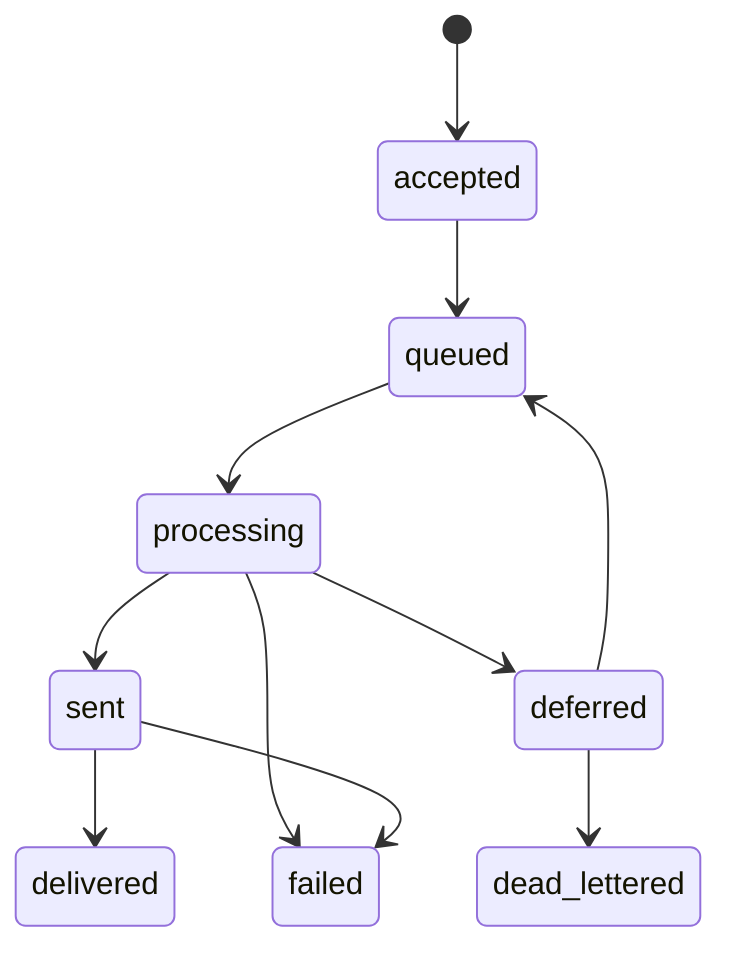

# Low-Level Design

## Recommended package structure

```text
ett_gns_app/
├── api/
├── auth/
├── tenants/
├── applications/
├── events/
├── templates/
├── providers/
├── notifications/
├── channels/
│   ├── email/
│   ├── sms/
│   ├── webhook/
│   ├── push/
│   ├── whatsapp/
│   └── telegram/
├── workers/
├── observability/
└── config.py
```

## Channel contract

```python
class ChannelAdapter(Protocol):
    channel_name: str

    def validate_provider_config(self, config: dict) -> None: ...
    def validate_recipient(self, recipient: dict) -> None: ...
    def validate_content(self, content: dict) -> None: ...
    def send(self, provider_config, sender, recipient, content, metadata) -> SendResult: ...
```

## Runtime algorithm

1. Authenticate credential
2. Resolve tenant and application
3. Verify credential belongs to app
4. Validate event and channel
5. Validate recipient
6. Validate data against event schema
7. Enforce quota/rate limit
8. Check idempotency
9. Create notification + outbox row in one DB transaction
10. Publish outbox event
11. Return 202

## Worker algorithm

1. Receive notification ID
2. Acquire processing lease
3. Load app/event/template/provider snapshots
4. Render template safely
5. Create delivery attempt
6. Call provider with timeout
7. Normalize result
8. Update notification
9. Retry or DLQ if needed
10. Emit delivery event

## State machine



## Retry classification

Retryable: timeout, connection reset, HTTP 429/5xx, SMTP 4xx.

Non-retryable: invalid recipient, invalid credentials, SMTP 5xx recipient failure, template/schema failure.

## Implementation baseline

Use Python 3.12+, FastAPI, Pydantic v2, SQLAlchemy 2.x, Alembic, Celery, RabbitMQ, Redis, and PostgreSQL. Preserve framework-independent domain services and repository interfaces.
