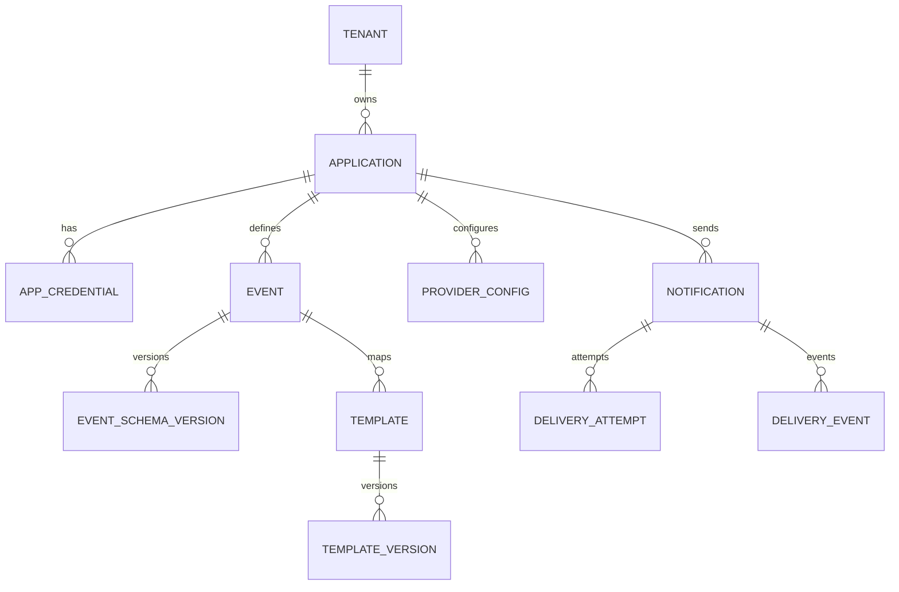

# Data and Domain Model

## Main entities

- Tenant
- Application
- ApplicationCredential
- Event
- EventSchemaVersion
- Template
- TemplateVersion
- ProviderConfig
- Notification
- DeliveryAttempt
- DeliveryEvent
- AuditEvent
- OutboxEvent

## ER overview



## Important uniqueness rules

```text
tenant.slug
(tenant_id, application.slug)
(application_id, event_key)
(application_id, event_id, channel, locale, variant)
(application_id, idempotency_key)
(template_id, version)
(notification_id, attempt_number)
```

## Storage guidance

- PostgreSQL 15+
- JSONB for event data, recipient, metadata, public provider config
- Secret manager reference instead of plaintext secret
- Partition notifications/attempts by month at high scale
- Retain raw event payload only as long as required
